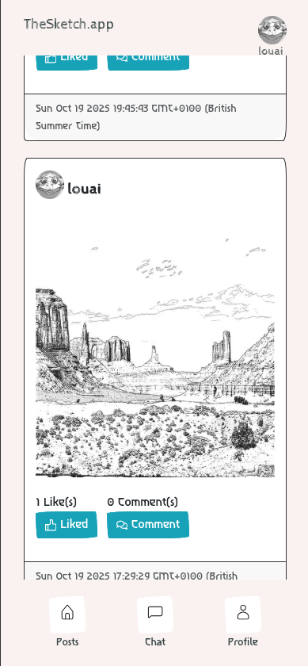
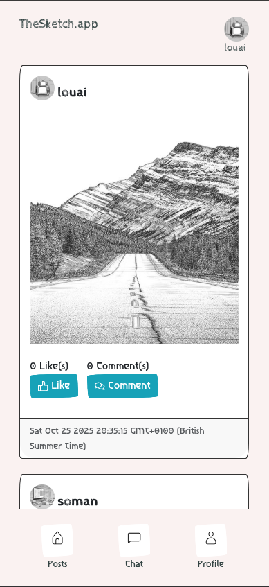
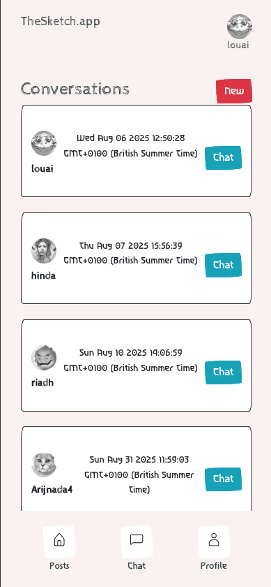
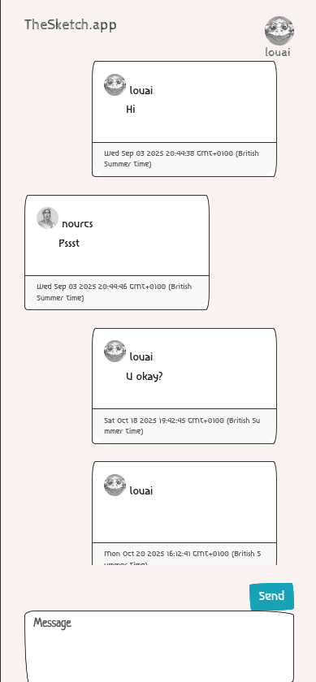

# SketchNFT
### Live Demo: [https://thesketch.app](https://thesketch.app)
- Our PWA could be downloaded from any mobile browser. 

### Home screen 



### Chat screen



## Summary
 SketchNFT is a social media application that allows uses to generate Sketch images from text or other images. Each image generate by the latent diffusion model is associated with an NFT collection. The users can also chat, comment and like other posts. 

### Use cases
A user can:
 1. Create an account
 2. Create a post and generate sketch images from text or other images
 3. Browse, comment, and like posts 
 4. Chat with other users 
 5. Generate a profile image
 6. View other users profiles
 7. Create an NFT for each post (only in the backend)
 8. Sell an NFT to other users (only in the backend)

### Technologies used
- React + Vite (PWA)
- Flask
- HuggingFace Inference Provider
- Crossmint

### Steps to run the app
#### Backend
1. navigate to the backend and install the libraries

```
pip install -r requirements.txt
```

2. run the app

```
python app.py
```

#### Frontend
1. navigate to the frontend, install the packages, and built the app
```
npm install
npm run build
npm run preview
```
- Note that you might need to change the api constante to match your ip address and the port where the app is running

### Authors
This app is made by Louai Zaiter and Soman Hamid during Encode London Hackathon 2025.


#### MIT License
